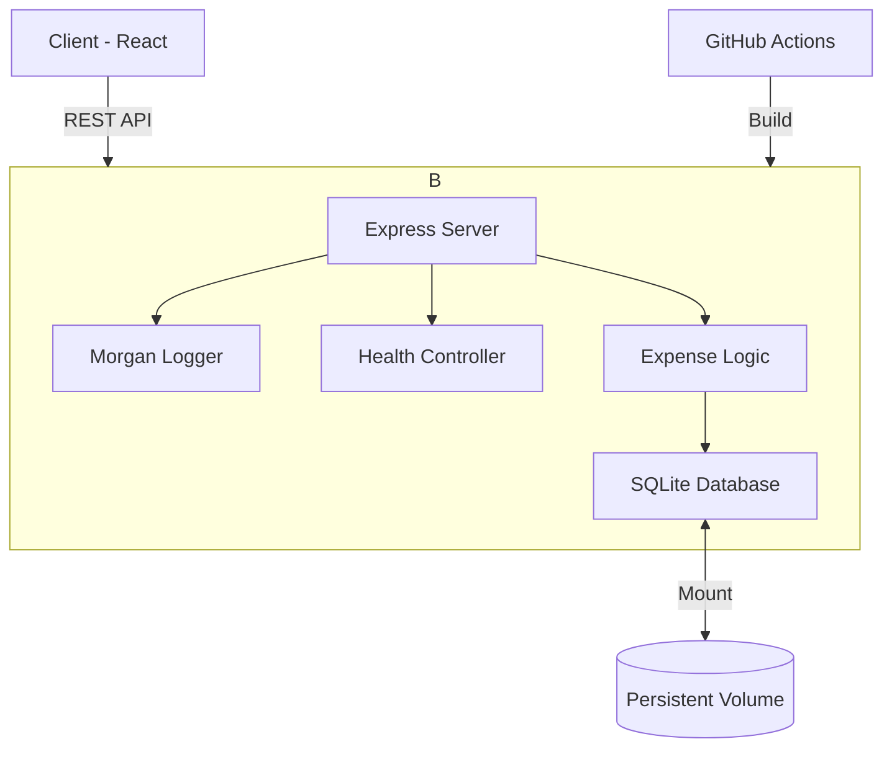

# 💸 PocketSplit — Production-Ready Expense Management

[](https://github.com/param3118/pocketsplit/actions)


[](https://pocketsplit-five.vercel.app/)

**PocketSplit** is a full-stack roommate expense splitter transformed into an operationally mature service. This project demonstrates high-density engineering, DevOps fundamentals, and production-inspired reliability.

---

## 🔗 Live Demo
Access the production application here: **[https://pocketsplit-five.vercel.app/](https://pocketsplit-five.vercel.app/)**

---

## 🚀 DevOps & Production Features

This version of PocketSplit introduces Case 5 maturity: **"Ship a Service Like You Mean It."**

- **🐳 Containerization**: Fully Dockerized with optimized multi-stage builds.
- **🔄 CI/CD Pipeline**: Automated GitHub Actions for building, testing, and Docker verification.
- **🩺 Health Monitoring**: Production-style `/health` and `/ready` endpoints.
- **📊 Structured Logging**: Request-level observability using `morgan`.
- **🔐 Environment Strategy**: Clean separation of configuration and code.
- **💾 Persistent Storage**: Reliable SQLite handling with Docker volumes.
- **🛡️ Error Handling**: Centralized, safe error management preventing server crashes.

---

## 📸 Operational Proof

| Feature | Screenshot Placeholder |
|---|---|
| **GitHub Actions** |  |
| **Docker Status** |  |
| **Health Check** |  |
| **Monitoring** |  |

---

## 🏗 System Architecture



---

## 🛠 Tech Stack

- **Backend**: Node.js (Alpine), Express
- **Frontend**: React 18, Axios
- **Database**: SQLite (via `@libsql/client`)
- **DevOps**: Docker, GitHub Actions, UptimeRobot
- **Logging**: Morgan (Structured STDOUT)

---

## ⚙️ Setup & Deployment

### Environment Variables
Copy `.env.example` to `.env` and configure:
```bash
PORT=5000
DB_PATH=./data/pocketsplit.db
NODE_ENV=production
```

### Docker Commands (The Production Way)
```bash
# Build the image
docker build -t pocketsplit .

# Run with persistence
docker run -d \
  -p 5000:5000 \
  -v pocketsplit_data:/app/data \
  --name pocketsplit-api \
  pocketsplit
```

### GitHub Actions
The pipeline triggers on every push/PR to `main`, ensuring:
1. Dependency integrity.
2. Successful frontend build.
3. Clean Docker image creation.

---

## 🩺 Monitoring & Health

### Health Endpoint
`GET /health`
Verifies both the API responsiveness and the database connection status.

### Ready Endpoint
`GET /ready`
Indicates the service is ready to accept traffic (useful for Kubernetes/Load Balancers).

### External Monitoring
Set up **UptimeRobot** to ping the `/health` endpoint every 5 minutes.
- **Expected Uptime**: 99.9%
- **Alerting**: Configured for email notifications on status changes.

---

## 📘 Documentation & Runbook

For detailed operational procedures, recovery steps, and failure scenarios, refer to the **[RUNBOOK.md](RUNBOOK.md)**.

---

## 📁 Folder Structure

```
pocketsplit/
├── .github/workflows/   # CI/CD Pipeline
├── client/              # React Frontend
├── server/              # Node.js Backend
│   ├── db/              # SQLite Logic
│   ├── middleware/      # Logging & Error Handling
│   └── index.js         # Entry Point & Health Checks
├── data/                # Local Persistence (Git Ignored)
├── Dockerfile           # Production Build
├── RUNBOOK.md           # Operational Manual
└── README.md            # You are here
```

---

## 🛡️ Reliability & Security
- **Graceful Shutdowns**: Handled by Node.js.
- **CORS Configured**: Secure cross-origin resource sharing.
- **Integer Math**: All currency handled in paise to avoid floating-point errors.
- **Soft Deletes**: Data integrity preserved through `is_deleted` flags.

---

*PocketSplit — Ship a Service Like You Mean It.*