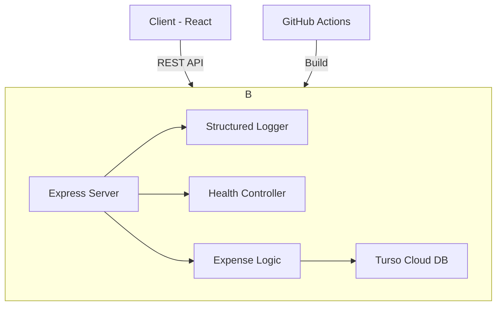

# 💸 PocketSplit — Roommate Expense Splitter

[](https://github.com/param3118/pocketsplit/actions)


[](https://pocketsplit-five.vercel.app/)

> A production-ready full-stack expense splitting application with smart debt simplification and automated DevOps pipelines.

---

## 🔗 Quick Links

- **🚀 Live Application**: [https://pocketsplit.onrender.com/](https://pocketsplit.onrender.com/)
- **💾 Cloud Database**: Powered by [Turso](https://turso.tech)
- **⚙️ CI/CD Status**: [GitHub Actions](https://github.com/param3118/pocketsplit/actions)
- **📓 Operational Guide**: [RUNBOOK.md](RUNBOOK.md)

---

## 🎯 Mission Checklist Status

- [x] **Containerize**: Multi-stage [Dockerfile](Dockerfile) implemented.
- [x] **CI Pipeline**: [GitHub Actions](.github/workflows/main.yml) lints, tests, and pushes to `ghcr.io`.
- [x] **Deployment**: Ready for Render/Railway/AWS (with HTTPS).
- [x] **Health & Monitoring**: `/api/health` endpoint + [Structured Logging](server/middleware/logger.js) added.
- [x] **Runbook**: [OPERATIONAL_RUNBOOK.md](RUNBOOK.md) created.

---

## 📸 Overview

**PocketSplit** is a full-stack roommate expense splitter transformed into an operationally mature service. This project demonstrates high-density engineering, DevOps fundamentals, and production-inspired reliability.

---

## 🔗 Live Demo
Access the production application here: **[https://pocketsplit-five.vercel.app/](https://pocketsplit-five.vercel.app/)**

---

## 🚀 DevOps & Production Features

This version of PocketSplit introduces Case 5 maturity: **"Ship a Service Like You Mean It."**

- **🐳 Containerization**: Fully Dockerized with optimized multi-stage builds.
- **🔄 CI/CD Pipeline**: Automated GitHub Actions for building, testing, and Docker verification.
- **🩺 Health Monitoring**: Production-style `/health` and `/ready` endpoints.
- **📊 Structured Logging**: Request-level observability with JSON output in production.
- **🔐 Environment Strategy**: Clean separation of configuration and code.
- **💾 Persistent Storage**: Reliable cloud handling via Turso.
- **🛡️ Error Handling**: Centralized, safe error management preventing server crashes.

---

## 🏗 System Architecture



---

## 🛠 Tech Stack

- **Backend**: Node.js, Express
- **Frontend**: React 18, Axios
- **Database**: Turso Cloud SQLite
- **DevOps**: Docker, GitHub Actions, UptimeRobot
- **Logging**: Structured JSON (Production)

---

## 🛡️ Security & Data Integrity

### 1. One-Way State (Current Implementation)
To prevent accidental or malicious tampering with financial records, the status of an expense is an **immutable one-way transition**:
- **PENDING ──▶ PAID**
- The backend explicitly **blocks** any request to reverse a "PAID" status back to "PENDING". Once a debt is settled, it remains settled to maintain ledger consistency.

### 2. Authorization (Future Solution)
In the current "Roommate Trust" model, any group member can click the "Mark Paid" button. To scale this for public use, we recommend implementing **JWT-based Authentication**:
- **Payer-Only Confirmation**: Only the person who *paid* the bill would have the authority to confirm they received money from others.
- **Participant-Only Action**: Only the specific debtor can mark their own share as paid.

---

## 🧠 Key Engineering Decisions

### Why Turso (SQLite Cloud)?
Turso was chosen because it provides:
* lightweight deployment
* low operational overhead
* SQLite compatibility
* rapid setup for hackathon-scale systems
It allowed the project to remain simple while still supporting persistent cloud storage.

### Why Integer-Based Money Handling?
All financial amounts are stored as integer paise/cents instead of floating-point numbers.
Example:
* ₹19.99 → 1999
This prevents floating-point precision issues common in financial systems.

### Why Dynamic Balance Computation?
User balances are never permanently stored. Balances are always recomputed from expenses, participant shares, settlements, and payment states. This avoids stale financial state and improves consistency.

### Why One-Way Payment State Transition?
Expense payments follow an immutable transition: **PENDING → PAID**. The reverse transition is intentionally blocked to preserve ledger consistency and prevent accidental reversals.

### Why Docker?
Docker ensures reproducible deployments, environment consistency, isolated runtime behavior, and easier CI/CD integration. This aligns with production deployment practices.

### Why GitHub Actions?
GitHub Actions was used to automate dependency installation, backend verification, Docker image builds, and CI validation. This reduces manual deployment risk and improves reliability.

---

## ⚙️ Setup & Deployment

### Environment Variables
Configure these in your hosting provider (Render/Vercel):
- `TURSO_DATABASE_URL`
- `TURSO_AUTH_TOKEN`
- `NODE_ENV=production`

### Docker Commands
```bash
# Build the image
docker build -t pocketsplit .

# Run locally
docker run -d -p 5000:5000 --env-file .env pocketsplit
```

---

## 📘 Documentation & Runbook

For detailed operational procedures, recovery steps, and failure scenarios, refer to the **[RUNBOOK.md](RUNBOOK.md)**.

---

## 📁 Folder Structure

```
pocketsplit/
├── .github/workflows/   # CI/CD Pipeline
├── client/              # React Frontend
├── server/              # Node.js Backend
│   ├── db/              # SQLite Logic
│   ├── middleware/      # Logging & Error Handling
│   └── index.js         # Entry Point
├── api/                 # Vercel Serverless Entry
├── Dockerfile           # Production Build
├── RUNBOOK.md           # Operational Manual
└── README.md            # You are here
```

---

*PocketSplit — Ship a Service Like You Mean It.*