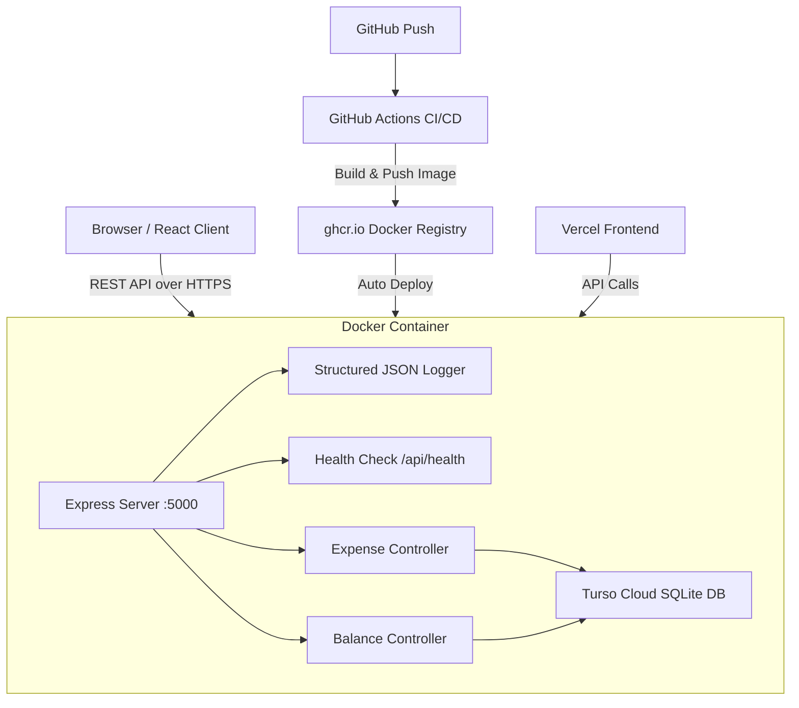

# 💸 PocketSplit — Roommate Expense Splitter

[](https://github.com/param3118/pocketsplit/actions)


[](https://pocketsplit-five.vercel.app/)

> A production-ready full-stack expense splitting application with smart debt simplification, dual-handshake payment verification, and automated DevOps pipelines.

---

## 🔗 Quick Links

| Resource | Link |
|---|---|
| 🚀 **Live Application** | [https://pocketsplit.onrender.com/](https://pocketsplit.onrender.com/) |
| 🎨 **Frontend (Vercel)** | [https://pocketsplit-five.vercel.app/](https://pocketsplit-five.vercel.app/) |
| 💾 **Cloud Database** | Powered by [Turso](https://turso.tech) |
| ⚙️ **CI/CD Status** | [GitHub Actions](https://github.com/param3118/pocketsplit/actions) |
| 📓 **Operational Guide** | [RUNBOOK.md](RUNBOOK.md) |

---

## 🎯 Mission Checklist Status

- [x] **Containerize**: Multi-stage [Dockerfile](../Dockerfile) implemented.
- [x] **CI Pipeline**: [GitHub Actions](../.github/workflows/main.yml) lints, tests, and pushes Docker image to `ghcr.io`.
- [x] **Deployment**: Live on Render (Docker) + Vercel (Frontend) with HTTPS.
- [x] **Health & Monitoring**: `/api/health` endpoint + [Structured JSON Logging](server/middleware/logger.js).
- [x] **Runbook**: [RUNBOOK.md](RUNBOOK.md) created for incident response.
- [x] **Security**: Dual-Handshake payment verification (PENDING → SENT → VERIFIED).

---

## 📸 Overview

**PocketSplit** is a full-stack roommate expense splitter transformed into an operationally mature, production-grade service. It demonstrates high-density engineering, DevOps fundamentals, and production-inspired reliability patterns including containerization, CI/CD pipelines, and financial ledger integrity.

---

## 🏗 System Architecture



---

## 🔒 Security & Authentication

PocketSplit implements a lightweight, low-friction security model optimized for roommate and group scenarios.

### 1. Group Passkeys (Authentication)
*   Groups can be secured with an optional **Passkey** at creation.
*   The passkey is hashed using `crypto.pbkdf2Sync` and stored in the database (`passcode_hash`).
*   The frontend securely caches valid passkeys in `sessionStorage` and injects them into the `X-Group-Passkey` header via Axios interceptors.
*   Access to protected group data (expenses, settlements, balances) is guarded by the `checkGroupAccess` Express middleware.

### 2. Dynamic Role-Based Access Control (RBAC)
Instead of static user roles (like "Admin" or "User"), PocketSplit enforces **context-dependent dynamic roles** based on the specific transaction:
*   **Creditor Authorization**: Only the person who paid for an expense (`paid_by`) can verify a payment receipt (`markPaid`), edit the expense, or delete it.
*   **Debtor Authorization**: Only the specific debtor can mark their own share of an expense as sent (`markSent`).
*   **Settlement Authorization**: Only the payer of a settlement can record that settlement.
*   These rules are enforced via the `X-User-Id` header against the specific resource owners in the database.

---

## 🛠 Tech Stack


| Layer | Technology |
|---|---|
| **Frontend** | React 18, Axios, Vanilla CSS |
| **Backend** | Node.js, Express.js |
| **Database** | Turso Cloud (LibSQL / SQLite) |
| **Containerization** | Docker (Multi-Stage Build) |
| **CI/CD** | GitHub Actions → ghcr.io |
| **Frontend Hosting** | Vercel |
| **Backend Hosting** | Render (Docker) |
| **Logging** | Structured JSON (Production) |
| **Monitoring** | `/api/health` endpoint |

---

## 🗄️ Database Schema

The database uses **7 tables** to model groups, members, expenses, and settlements.

### `users`
Stores all members across all groups. Names are globally unique.
```sql
CREATE TABLE users (
  id         INTEGER PRIMARY KEY AUTOINCREMENT,
  name       TEXT NOT NULL UNIQUE,
  created_at TEXT NOT NULL DEFAULT (datetime('now'))
);
```

### `groups_table`
A named group (e.g., "Mumbai Flat", "Goa Trip").
```sql
CREATE TABLE groups_table (
  id            INTEGER PRIMARY KEY AUTOINCREMENT,
  name          TEXT NOT NULL,
  passcode_hash TEXT,
  created_at    TEXT NOT NULL DEFAULT (datetime('now'))
);
```

### `group_members`
Links users to groups (Many-to-Many relationship).
```sql
CREATE TABLE group_members (
  group_id INTEGER NOT NULL REFERENCES groups_table(id) ON DELETE CASCADE,
  user_id  INTEGER NOT NULL REFERENCES users(id) ON DELETE RESTRICT,
  PRIMARY KEY (group_id, user_id)
);
```

### `expenses`
Core table. All amounts are stored as **INTEGER PAISE** (₹19.99 → 1999) to avoid floating-point errors.
```sql
CREATE TABLE expenses (
  id             INTEGER PRIMARY KEY AUTOINCREMENT,
  transaction_id TEXT    NOT NULL UNIQUE,           -- e.g. EXP-0001
  group_id       INTEGER NOT NULL REFERENCES groups_table(id),
  title          TEXT    NOT NULL,
  total_amount   INTEGER NOT NULL,                  -- In paise (cents)
  paid_by        INTEGER NOT NULL REFERENCES users(id),
  split_type     TEXT    NOT NULL CHECK(split_type IN ('equal','unequal')),
  note           TEXT,
  is_deleted     INTEGER NOT NULL DEFAULT 0,        -- Soft delete flag
  created_at     TEXT    NOT NULL DEFAULT (datetime('now'))
);
```

### `expense_shares`
How much each participant owes for a specific expense.
```sql
CREATE TABLE expense_shares (
  id           INTEGER PRIMARY KEY AUTOINCREMENT,
  expense_id   INTEGER NOT NULL REFERENCES expenses(id) ON DELETE CASCADE,
  user_id      INTEGER NOT NULL REFERENCES users(id),
  share_amount INTEGER NOT NULL                     -- In paise
);
```

### `expense_payment_status` ⭐ Dual-Handshake
The **3-state** payment verification table. This is the core of the security model.
```sql
CREATE TABLE expense_payment_status (
  id         INTEGER PRIMARY KEY AUTOINCREMENT,
  expense_id INTEGER NOT NULL REFERENCES expenses(id) ON DELETE CASCADE,
  user_id    INTEGER NOT NULL REFERENCES users(id),
  is_paid    INTEGER NOT NULL DEFAULT 0,  -- 0=PENDING, 1=SENT, 2=VERIFIED
  paid_at    TEXT                         -- Timestamp of final verification
);
```
| State | Value | Who Sets It | Meaning |
|---|---|---|---|
| PENDING | `0` | System | Default. No action taken. |
| SENT | `1` | **Debtor** | "I have transferred the money." |
| VERIFIED | `2` | **Creditor** | "I have received the money." ✅ |

### `settlements`
Records final manual settlement transactions between two people.
```sql
CREATE TABLE settlements (
  id             INTEGER PRIMARY KEY AUTOINCREMENT,
  transaction_id TEXT    NOT NULL UNIQUE,
  group_id       INTEGER NOT NULL REFERENCES groups_table(id),
  payer_id       INTEGER NOT NULL REFERENCES users(id),
  receiver_id    INTEGER NOT NULL REFERENCES users(id),
  amount         INTEGER NOT NULL,                  -- In paise
  note           TEXT,
  created_at     TEXT    NOT NULL DEFAULT (datetime('now'))
);
```

### `txn_counter`
Generates auto-incrementing, prefixed transaction IDs (e.g., `EXP-0001`, `STL-0003`).
```sql
CREATE TABLE txn_counter (
  prefix   TEXT    PRIMARY KEY,
  last_seq INTEGER NOT NULL DEFAULT 0
);
```

---

## 📡 API Reference

Base URL: `https://pocketsplit.onrender.com/api`

All responses follow the format:
```json
{ "success": true, "data": { ... } }
{ "success": false, "error": "Error message" }
```

### 👥 Groups

| Method | Endpoint | Description |
|---|---|---|
| `GET` | `/groups` | Get all groups |
| `GET` | `/groups/:id` | Get a single group |
| `POST` | `/groups` | Create a new group |
| `PUT` | `/groups/:id` | Update a group name |
| `DELETE` | `/groups/:id` | Delete a group |

### 👤 Members

| Method | Endpoint | Description |
|---|---|---|
| `GET` | `/members/:groupId` | Get all members of a group |
| `POST` | `/members` | Add a member to a group |
| `DELETE` | `/members/:groupId/:userId` | Remove a member from a group |

### 💰 Expenses

| Method | Endpoint | Description |
|---|---|---|
| `GET` | `/expenses/:groupId` | Get all expenses for a group |
| `GET` | `/expense/detail/:id` | Get full detail of one expense |
| `POST` | `/expenses` | Create a new expense |
| `PUT` | `/expenses/:id` | Update an expense |
| `DELETE` | `/expenses/:id` | Soft-delete an expense |
| `POST` | `/expenses/:id/mark-sent` | 🟡 **Debtor** marks payment as Sent |
| `POST` | `/expenses/:id/mark-paid` | ✅ **Creditor** verifies payment received |

#### Create Expense — Request Body:
```json
{
  "group_id": 1,
  "title": "Hotel Bill",
  "total_amount": 200000,
  "paid_by": 3,
  "split_type": "equal",
  "participants": [1, 2, 3, 4],
  "note": "Goa Trip Day 1"
}
```

#### Mark Sent / Mark Paid — Request Body:
```json
{ "user_id": 2 }
```

### ⚖️ Balances & Debt Simplification

| Method | Endpoint | Description |
|---|---|---|
| `GET` | `/balances/:groupId` | Get net balances + simplified debt transactions |

#### Balance Response:
```json
{
  "balances": [
    { "user_id": 1, "name": "Rahul", "balance": 1100 },
    { "user_id": 2, "name": "Param", "balance": -900 }
  ],
  "simplified_debts": [
    { "from": "Param", "to": "Rahul", "amount": 900 }
  ]
}
```

### 🤝 Settlements

| Method | Endpoint | Description |
|---|---|---|
| `POST` | `/settlements` | Record a manual settlement |
| `GET` | `/settlements/:groupId` | Get settlement history |

### 🩺 Health

| Method | Endpoint | Description |
|---|---|---|
| `GET` | `/health` | Returns server health status |

#### Health Response:
```json
{
  "status": "healthy",
  "timestamp": "2026-05-14T10:00:00.000Z",
  "uptime": 12345.67,
  "environment": "production"
}
```

---

## 🛡️ Security & Data Integrity

### Dual-Handshake Payment Verification
The system prevents any single person from falsely marking a debt as "Paid."

```
Debtor clicks "Mark Sent"     → Status: 1 (SENT)
Creditor clicks "Verify"      → Status: 2 (VERIFIED) ✅
```

- The **Debtor** can only mark their OWN share as Sent.
- The **Creditor** (the original payer) is the ONLY one who can give final verification.
- Once VERIFIED (state 2), the status **cannot be reversed** (immutable ledger).

### Integer-Based Money (No Floating Point)
```
₹19.99  →  stored as  1999
₹1500   →  stored as  150000
```
All arithmetic is done in integer paise to prevent floating-point rounding errors.

### Soft Deletes
Expenses are never truly deleted. The `is_deleted = 1` flag hides them from views while preserving the financial audit trail.

---

## 🧠 Key Engineering Decisions

### Why Turso (SQLite Cloud)?
- Lightweight, zero-config cloud database
- SQLite-compatible (easy local testing)
- Low operational overhead for hackathon-scale systems

### Why Dynamic Balance Computation?
Balances are **never stored**. They are always recomputed from live expense + payment data. This ensures zero stale state and perfect consistency.

### Why Dual-Handshake?
A simple "Mark Paid" button is vulnerable to abuse. The 3-state model (PENDING → SENT → VERIFIED) requires agreement from both parties before a debt is closed — modelled after real payment confirmation flows.

### Why Greedy Debt Simplification?
Instead of N×(N-1) raw transactions, the algorithm computes net balances and greedily matches the biggest debtor to the biggest creditor. For N people, at most N-1 transactions are ever needed.

### Handling International Currency (Future-Proofing)
If PocketSplit went international, we would **not** change the integer math. We would continue to store amounts as integers in the lowest common denominator (e.g., Cents for USD, Paise for INR) and add a `currency_code` (e.g., "USD") and an `exchange_rate` column to the `expenses` table at the exact time of creation. The backend would normalize everything to a single base currency for the $O(N \log N)$ balance calculation, and the React frontend would handle formatting it back to local symbols ($, €, ₹).

### Why Multi-Stage Docker Build?
- Stage 1 builds the React app (heavy, 500MB+ of dev tools).
- Stage 2 copies only the final build artifacts + backend.
- Result: a lean, secure ~150MB production image.

---

## 🐳 Docker Guide

### Repository Structure (Why files are at the root)
```
/ (GitHub Repository Root)
├── .github/workflows/main.yml  ← GitHub Actions looks here
├── Dockerfile                  ← Docker builds from here
└── pocketsplit/                ← Your application code
    ├── client/
    ├── server/
    └── package.json
```

### Build & Run Locally
```bash
# 1. Build the image (run from the REPO ROOT, not inside pocketsplit/)
docker build -t pocketsplit:latest .

# 2. Run the container
# -p HOST_PORT:CONTAINER_PORT (outside window : inside door)
docker run -d \
  --name pocketsplit-app \
  -p 5000:5000 \
  --env TURSO_DATABASE_URL=your_url \
  --env TURSO_AUTH_TOKEN=your_token \
  pocketsplit:latest

# 3. Open in browser
# http://localhost:5000
```

### Port Explanation
```
Your Browser (5000) → Docker Host (5000) → Container App (5000)
                         ↑
                   -p 5000:5000
              [Outside Window]:[Inside Door]
```

---

## ⚙️ CI/CD Pipeline

Every `git push` to `main` triggers:

```
1. Checkout Code
2. Setup Node.js 18
3. Install Dependencies (cd pocketsplit && npm install)
4. Run Tests (npx mocha server/test.js)
5. Login to GitHub Registry (ghcr.io)
6. Build Docker Image
7. Push Image → ghcr.io/param3118/pocketsplit:main
```

Render then auto-detects the new image and redeploys.

---

## 🚀 Deployment Setup

### Environment Variables (Required everywhere)
```env
TURSO_DATABASE_URL=libsql://your-db.turso.io
TURSO_AUTH_TOKEN=your_turso_token
NODE_ENV=production
PORT=5000
```

### Render Settings
| Setting | Value |
|---|---|
| **Root Directory** | *(empty)* |
| **Dockerfile Path** | `./Dockerfile` |
| **Build Context** | `.` |
| **Auto-Deploy** | On Commit |

---

## 📁 Folder Structure

```
pocketsplit/
├── .github/workflows/main.yml  # CI/CD Pipeline (at repo root)
├── Dockerfile                  # Multi-stage Docker build (at repo root)
├── pocketsplit/
│   ├── client/                 # React 18 Frontend
│   │   └── src/
│   │       ├── components/     # UI Components
│   │       └── api/api.js      # Axios API Client
│   ├── server/
│   │   ├── controllers/        # Business Logic
│   │   ├── db/                 # Schema & Database Client
│   │   ├── middleware/         # Logger & Error Handler
│   │   ├── routes/index.js     # All API Routes
│   │   └── index.js            # Express Entry Point
│   ├── api/                    # Vercel Serverless Entry
│   ├── RUNBOOK.md              # Operational Manual
│   └── README.md               # You are here
```

---

## 📘 Operational Runbook

For detailed procedures, refer to **[RUNBOOK.md](RUNBOOK.md)**.

### 🚨 2 AM Incident Response (What to do if it's down)
1. **Check the Health Endpoint:** Hit `GET /health`. 
   - If it returns `503 Service Unavailable`, the Node server is up but Turso Database is down. Check the Turso status page.
   - If the request times out, the Node container is dead. 
2. **Check Logs:** Log into the Render dashboard and read the recent structured JSON logs. Look for fatal exceptions.
3. **Emergency Rollback (The "Fix it fast" button):**
   - **Do NOT debug at 2 AM.** Roll back to the last known working state immediately.
   - Go to your Render dashboard → Deployments.
   - Find the last successful deployment from before the outage and click **"Rollback to this deploy"**.
   - Render will immediately pull the previous Docker image from GitHub Container Registry (GHCR) and spin it up.
   - Once the service is green again, go to sleep and debug the bad code locally in the morning.

---

*PocketSplit — Ship a Service Like You Mean It. 🚀*